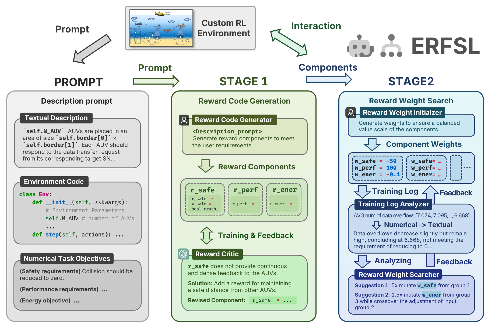

# LLMRsearcher-code

[](https://arxiv.org/abs/2409.02428v2)  [](https://360zmem.github.io/LLMRsearcher) [](https://360zmem.github.io/LLMRsearcher)

⚠ We are testing the code repository. Until then, the code may not work properly. Also, you can find our simplified Python implementation of underwater information collection task under the `RL_task` folder in the code repository. Please feel free to contact [@360ZMEM](mailto:gwxie360@outlook.com)(Guanwen Xie) if you encounter any issue.

- Oct 22, 2024 - We update the full python code.
- Oct 16, 2024 - We released our early-version code.
- Sep 21, 2024 - The GitHub page and supplementary material [](https://360zmem.github.io/LLMRsearcher) of LLMRsearcher is available.

---

This repository contains langchain🦜️🔗 0.3 implementation code for paper [LLMs as Efficient Reward Function Searchers for Custom-Environment MORL](https://360zmem.github.io/LLMRsearcher). 



## Get Started

Run this command to install dependencies:

```bash
pip install -r ./requirements.txt
```

Our paper uses the OpenAI API for language model queries. Therefore, ensure that you specify the OpenAI API key and base address (if applicable) in the `config.py` file:

```python
openai_api_key = 'your_api_key'
openai_api_base = 'https://api.openai.com/' # an example
openai_model = 'gpt-4o-mini'
opensource_model = None # 'meta-llama/Meta-Llama-3-70B' / 'Qwen/Qwen2.5-72B' ...
```

Alternatively, if you wish to use open-source LLMs such as Llama or Qwen, specify the model's name in `opensource_model`. Notice that specifying this will override the `openai_model` argument.

## Reward Code Search

The following script executes the reward code design and feedback process unattended:

```bash
python reward_code_search.py
```

Alternatively, you can execute the reward code design and feedback process separately. Run this command to generate the reward function code:

```bash
python ERFSL/reward_code_gen.py
```

The following script repeatedly validates the reward components through training and revises them using the reward critic until all components meet the corresponding requirements:

```bash
python reward_code_tfeedback.py
```

## Reward Weight Search

Similarly, you can run this script to execute the reward weight generating and search process unattended.

```bash
python reward_weight_search.py
```

Alternatively, first run this command to generate initial weight groups:

```bash
python ERFSL/reward_weight_initializer.py
```

NOTE: You can interrupt the script execution at any time, and if you run it again, the script will continue training from the last full iteration before interruption. If this is not what you want, you can remove all temporary files in the `reward_funcs` folder, or specify this argument:

```bash
python reward_weight_search.py --restart
```

## Custom Environment Guide

ERFSL can also be deployed to your custom MORL environment and can effectively benefit from human prior knowledge, although ERFSL also works well without prior knowledge. For more information, refer to the document [custom_guide.md](custom_guide.md).

## Citation

If you find it useful for your work please cite:
```bibtex
@article{xie2024llmrsearcher,
      title={Large Language Models as Efficient Reward Function Searchers for Custom-Environment Multi-Objective Reinforcement Learning},
      author={Xie, Guanwen and Xu, Jingzehua and and Yang, Yiyuan and Ren, Yong and Ding, Yimian and Zhang, Shuai},
      journal={arXiv preprint arXiv:2409.02428},
      year={2024}
    }
```


