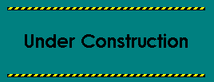

# LLMRsearcher-code

   

We are currently restructuring the code using LangChain 0.3, which is expected to be completed by 2024.10. Please refer to the supplementary material to obtain the full prompts. Additionally, you may refer to the `SUPP_tex` folder, which contains the `tex` source file of the supplementary material, for ease of copying.

